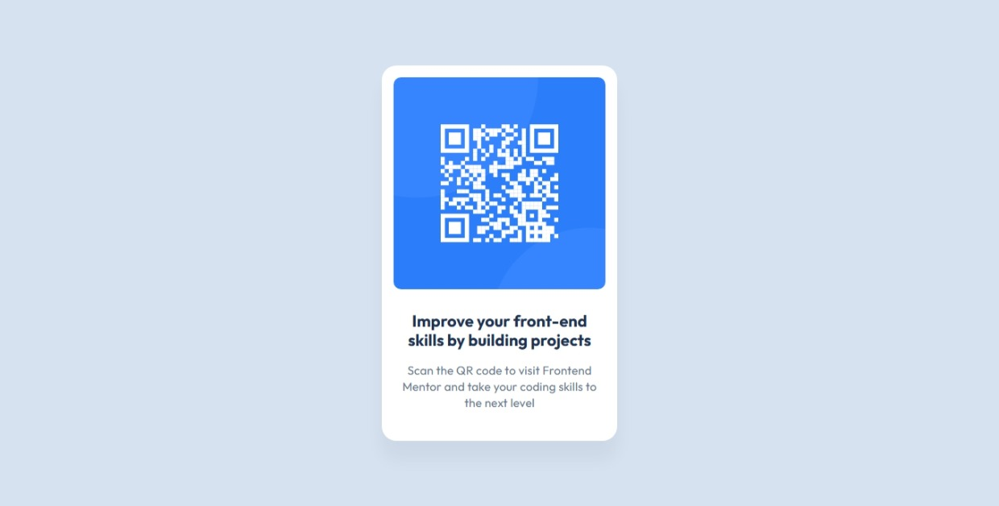

# Frontend Mentor - QR code component solution
This is a solution to the [QR code component challenge on Frontend Mentor](https://www.frontendmentor.io/challenges/qr-code-component-iux_sIO_H).

## Table of contents
- [Overview](#overview)
  - [Screenshot](#screenshot)
  - [Links](#links)
- [My process](#my-process)
  - [Built with](#built-with)
- [Author](#author)
- [Acknowledgments](#acknowledgments)

## Overview
This is an easy small project that I tried to code, It is a simple one no layout shifts or responsiveness issues.

### Screenshot

### Links
- Solution URL: [github repo](https://github.com/zakaria-guenifi/qr-code-component)
- Live Site URL: [live url](https://zakaria-guenifi.github.io/qr-code-component/)

## My process
I started by exploring the project files and inspecting the Figma design to decide on my approach. Then, I set up the design system, built the HTML structure, and styled the components using CSS.

### Built with
- Semantic HTML5 markup
- Vanilla CSS

## Author
- Website - [Zakaria Guenifi](https://www.guenifi.com)
- Frontend Mentor - [@zakaria-guenifi](https://www.frontendmentor.io/profile/zakaria-guenifi)

## Acknowledgments
I made sure to avoid the mistakes and accessibility issues I encountered in my last Frontend Mentor project.
